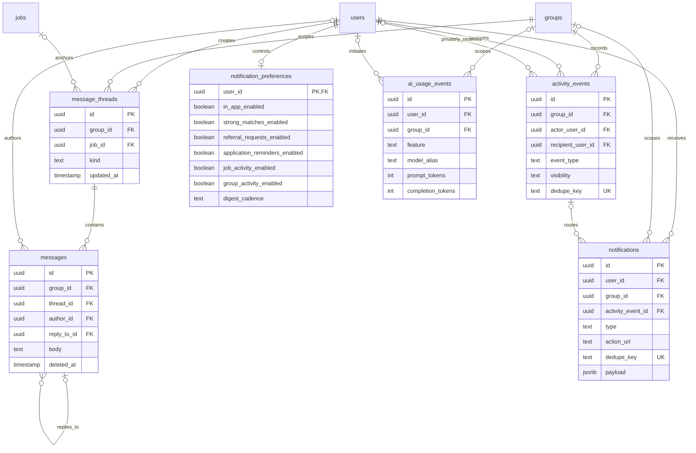

# Groups Architecture

## Authentication Boundary

Better Auth is mounted at `/api/auth/*` and is the shared HTTP authentication boundary for the web application and future native clients. Web-specific client code is isolated in `src/lib/auth-client.ts`; native clients can use Better Auth's Expo adapter without changing the database or authorization layer.

Authentication uses database-backed sessions with a seven-day expiry and daily rotation. Better Auth's origin and CSRF checks remain enabled, trusted origins are explicit, production cookies are secure and HTTP-only, and proxy checks are only an early redirect optimization. Protected layouts and server services verify the authoritative session before reading or mutating protected data.

Email identities are normalized before persistence. Password policy is enforced in the Better Auth request hook, not only in the form. New identities receive an idempotent private profile bootstrap record. Account deletion remains disabled until a verified, recently authenticated deletion flow is implemented.

## Database Foundation

The MVP uses Neon Postgres through Drizzle ORM. The TypeScript schema is split by domain under `src/server/db/schema`, while `src/server/db/schema.ts` is the migration and application export boundary.

The database is intentionally object-first. Jobs, shares, applications, referrals, threads, outcomes, and reputation events are independent records rather than message payloads.

## Core ERD

```mermaid
erDiagram
  users {
    uuid id PK
    text email UK
    text name
    boolean email_verified
  }
  accounts {
    uuid id PK
    uuid user_id FK
    text provider_id
    text account_id
  }
  sessions {
    uuid id PK
    uuid user_id FK
    text token UK
    timestamp expires_at
  }
  verifications {
    uuid id PK
    text identifier
    text value
    timestamp expires_at
  }
  profiles {
    uuid user_id PK,FK
    text display_name
    text current_role
    jsonb skills
    text visibility
  }
  profile_preferences {
    uuid user_id PK,FK
    jsonb desired_roles
    jsonb preferred_locations
    text remote_preference
  }
  groups {
    uuid id PK
    text slug UK
    text engine_key
    uuid owner_id FK
    jsonb settings
  }
  group_memberships {
    uuid id PK
    uuid group_id FK
    uuid user_id FK
    text role
    text status
  }
  group_invites {
    uuid id PK
    uuid group_id FK
    uuid inviter_id FK
    text token_hash UK
    timestamp expires_at
  }
  jobs {
    uuid id PK
    text canonical_url UK
    text company
    text title
    text status
    jsonb skills
  }
  job_shares {
    uuid id PK
    uuid group_id FK
    uuid job_id FK
    uuid sharer_id FK
    timestamp shared_at
  }
  job_embeddings {
    uuid job_id PK,FK
    vector embedding
    text model_alias
    text content_hash
  }
  user_job_states {
    uuid user_id PK,FK
    uuid job_id PK,FK
    boolean seen
    boolean saved
    boolean dismissed
  }
  applications {
    uuid id PK
    uuid user_id FK
    uuid job_id FK
    uuid source_group_id FK
    text status
    text visibility
    text private_notes
    text next_action
    date next_action_date
  }
  application_status_events {
    uuid id PK
    uuid application_id FK
    text from_status
    text to_status
    timestamp created_at
  }
  referral_requests {
    uuid id PK
    uuid requester_id FK
    uuid potential_referrer_id FK
    uuid job_id FK
    uuid group_id FK
    text state
  }
  referral_request_state_events {
    uuid id PK
    uuid request_id FK
    text from_state
    text to_state
    uuid changed_by_user_id FK
    text note
    timestamp created_at
  }
  outcomes {
    uuid id PK
    uuid group_id FK
    uuid job_id FK
    uuid subject_user_id FK
    uuid shared_by_user_id FK
    uuid referred_by_user_id FK
    text visibility
  }
  reputation_events {
    uuid id PK
    uuid group_id FK
    uuid recipient_user_id FK
    uuid actor_user_id FK
    text event_type
    text source_entity_type
    uuid source_entity_id
    int points
  }
  user_reputation_summaries {
    uuid group_id PK,FK
    uuid user_id PK,FK
    int total_points
    int jobs_shared
    int jobs_saved_by_members
    int applications_attributed
    int referrals_completed
    int interviews_helped
    int hires_helped
    timestamp calculated_at
  }

  users ||--o{ accounts : authenticates
  users ||--o{ sessions : owns
  users ||--|| profiles : has
  users ||--|| profile_preferences : controls
  users ||--o{ groups : owns
  users ||--o{ group_memberships : joins
  groups ||--o{ group_memberships : contains
  groups ||--o{ group_invites : issues
  users ||--o{ group_invites : creates
  groups ||--o{ job_shares : receives
  jobs ||--o{ job_shares : is_shared_as
  users ||--o{ job_shares : shares
  jobs ||--|| job_embeddings : represents
  users ||--o{ user_job_states : tracks
  jobs ||--o{ user_job_states : receives_state
  users ||--o{ applications : owns
  jobs ||--o{ applications : targets
  applications ||--o{ application_status_events : records
  groups ||--o{ referral_requests : scopes
  jobs ||--o{ referral_requests : concerns
  users ||--o{ referral_requests : requests
  referral_requests ||--o{ referral_request_state_events : records
  groups ||--o{ outcomes : attributes
  jobs ||--o{ outcomes : produces
  groups ||--o{ reputation_events : records
  users ||--o{ reputation_events : receives
  groups ||--o{ user_reputation_summaries : caches
  users ||--o{ user_reputation_summaries : has
```

Reputation events are append-only evidence records created from verified domain
actions. `user_reputation_summaries` is a disposable read cache and must remain
fully recalculable from those events. The application never awards reputation
for message volume; repeated job sharing is point-limited and duplicate source
credit is rejected.

## Communication And System ERD

`activity_events` is the canonical, idempotent stream for useful product
events. Notifications are recipient-specific deliveries routed from that
stream after active membership and user preferences are checked. Private
events always carry a recipient; shared activity queries must filter to
`visibility = 'group'`.

Daily and weekly catch-ups are generated for one authenticated recipient at a
time from deterministic domain data. They do not persist a group-wide digest
payload. Strong matches may read that recipient's private career preferences,
and saved-job actions may read that recipient's private tracker, but neither
the inputs nor another member's application state can enter group highlights.
AI may summarize this deterministic result later; it must not decide which
private records are eligible.

## Enforced Invariants

- `groups.engine_key` is typed text and currently accepts only `jobs`.
- Invite tokens are stored as unique hashes, with expiry, revocation, and use limits.
- A canonical `jobs` record is separate from each member's `job_shares` record.
- Applications default to `private`; their seven tracker stages run from `saved` through `hired`, and status changes are append-only events. Private notes and next actions remain owner-scoped in the server data layer.
- Referral requests use explicit `requested`, `accepted`, `declined`, `needs_info`, `referred`, and `closed` states with append-only history. Candidate matching uses only profile-visible fields and group-visible sharing context; request details are limited to participants and allowed admins.
- Public profile fields and private matching preferences are separate tables.
- Message-to-thread foreign keys include `group_id`, preventing cross-group thread references.
- Group-visible outcomes require explicit consent and a sharing timestamp.
- Reputation events are append-only; summaries are recalculable caches.
- AI usage metadata records model aliases and token/cost data, never raw prompt text.

## Migrations And Seed Data

- `npm run db:generate` generates migrations from the TypeScript schema.
- `npm run db:check` checks migration snapshot consistency.
- `npm run db:migrate` applies pending migrations to `DATABASE_URL`.
- `npm run db:seed` loads local environment files and inserts idempotent fictional data.

Migration `0000` enables pgvector before tables are created. Development seed data uses only `example.test` identities and URLs.

## Ask This Group Retrieval

Ask this Group uses a derived `group_knowledge_documents` pgvector index. The
index is rebuilt incrementally from authoritative jobs, job shares, public job
discussions, visible profile fields, consented group outcomes, and contribution
summaries. Every document carries a `group_id`; membership is checked before
source loading and again in the vector query.

Private profile preferences and application notes are never indexed. A signed-in
member's own saved-but-not-applied state may be loaded for a relevant question,
but it remains request-local and is never written to the shared index. Removed or
newly hidden source documents are deleted before retrieval. OpenAI requests use
`store: false`, structured answer output is validated, citations are limited to
retrieved source keys, and usage logs contain only operational metadata rather
than questions or source content.
